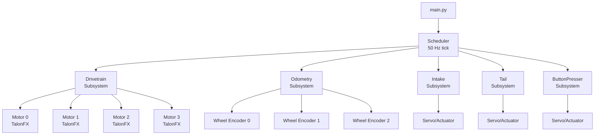

# Robotics Motor & Scheduler System

A Python-based framework for controlling motors, subsystems, and autonomous routines using a generator-driven scheduler. Designed for modular, non-blocking, and safe robotics operation with Phoenix6 TalonFX motors.

---

## Overview



This diagram illustrates the high-level architecture of the robotics system. The `main.py` script initializes the `Scheduler`, which runs at 50 Hz to update all subsystems. Subsystems like `Drivetrain` manage multiple TalonFX motors, while `Odometry` uses wheel encoders for positioning. Other subsystems control servos and actuators for specific tasks.

- A **Motor utility class** with internal state management (IDLE / RUNNING)  
- A **Drivetrain subsystem** to manage multiple motors  
- A **Scheduler** that ticks all subsystems at a configurable frequency  
- **Generator-based autonomous routines** for non-blocking command sequences  
- Safe **emergency stop** handling  

The system is designed to run all motors and subsystems at a fixed tick rate (e.g., 50 Hz) while allowing autonomous routines to be written sequentially using `yield` / `yield from`.

---

## Features

- **Motor Class**
  - Low-level wrapper for TalonFX motors
  - Handles initialization and duty-cycle control with duration
  - Maintains internal state (IDLE / RUNNING)
  - Designed to be managed by higher-level subsystems like Drivetrain

- **Scheduler**
  - Manages all subsystems uniformly  
  - Feeds the enable signal periodically (`feed_enable`)  
  - Supports generator-based autonomous routines  
  - Stops all motors safely on completion or emergency  

- **Autonomous Routines**
  - Written as Python generators for sequential commands  
  - Interleaves subsystem updates automatically  
  - Non-blocking: motors can run simultaneously without freezing the loop  

---

## Installation for Pi

This project is designed to run on a Raspberry Pi with the necessary hardware (TalonFX motors via CAN bus, Adafruit servos, etc.).

### Prerequisites
- Python 3.13.5 or later
- pip 25.1.1 or later
- Raspberry Pi with CAN bus configured for TalonFX motors
- Adafruit hardware for servos and sensors

### Setup
1. Clone the repository:
   ```bash
   git clone https://github.com/UGARobotics/ieee-2026.git
   cd ieee-2026
   ```

2. Install dependencies:
   ```bash
   pip install -r requirements.txt
   ```

3. Ensure the CAN bus is configured (e.g., using `canivore` named "Main").

4. Run the main script:
   ```bash
   python main.py
   ```

---

## Usage

The main entry point is `main.py`, which initializes motors, subsystems, and runs autonomous routines.

- Motors are initialized with IDs and CANivore name.
- Subsystems like Drivetrain, Odometry, Intake, etc., are added to the Scheduler.
- The Scheduler runs at 50 Hz, updating all subsystems and feeding the enable signal.
- Autonomous routines are generator-based for non-blocking execution.

---

## Subsystems

- **Drivetrain**: Manages four motors for movement.
- **Odometry**: Tracks position and orientation.
- **Intake**: Handles intake mechanisms.
- **Tail**: Controls tail subsystem.
- **ButtonPresser**: Presses buttons with servos.
- **StartupSystem**: Initializes sensors and lights.

---

## TODO

- button_presser.py: Adjust angle (lines 10, 16)
- startup_system.py: Adjust pin number (line 14)
- startup_system.py: Initialize light sensor when set up (line 21)
- startup_system.py: Check for status of light (line 35)
- motor.py: Fix PID profile setting - currently forcibly sets to 0, but up to 3 can be saved (line 30)
- motor.py: Setting PID configs, see above TODO (line 71)
- routines.py: WE GO FULL ROTATION 2PI + PI/2 (lines 299, 605)
- routines.py: Maybe add a timeout to the WAITING state in the startup routine (line 299)